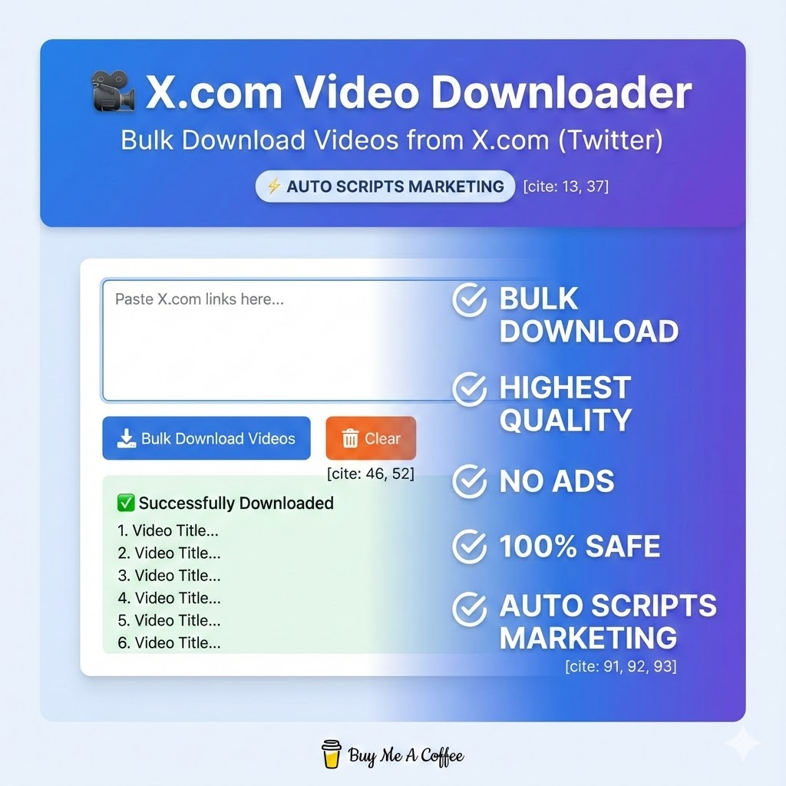

# 🎥 Ultimate X (Twitter) Video Downloader - Bulk & Ad-Free

> **Stop struggling with sketchy websites.** Download X (Twitter) videos in bulk, highest quality, and 100% safe using Google Colab.

*(Note: Upload the image created earlier to your repo and link it here)*

## 🚀 Why Use This Tool?

Most online video downloaders are filled with pop-up ads, malware risks, and slow servers. This tool runs directly on Google's secure servers (Colab) using open-source Python libraries.

* **⚡ Bulk Downloading:** Paste a list of 10, 20, or 50 links and download them all at once.
* **🛡️ 100% Safe & Private:** No ads, no trackers, no shady redirects.
* **💎 Highest Quality:** Automatically selects the best resolution (mp4).
* **🎨 Beautiful GUI:** Easy-to-use interface powered by `ipywidgets`.
* **☁️ Cloud-Based:** Runs on Google Colab, so it works on any computer (Windows, Mac, Linux, Chromebook).

## 🛠️ How to Use (3 Steps)

1.  **Click the "Open in Colab" badge** above 👆.
2.  Click the **Play button (▶️)** to initialize the tool.
3.  **Paste your links** (one per line) and hit **Download**.

> **Note:** The files will be saved to your session and you can download them to your local device instantly.

## 📦 Requirements

* A Google Account (to use Google Colab).
* No coding knowledge required!

